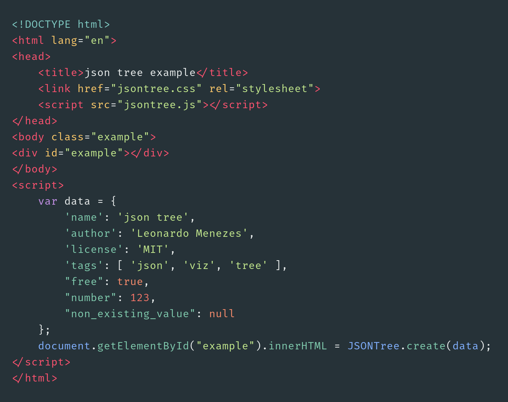
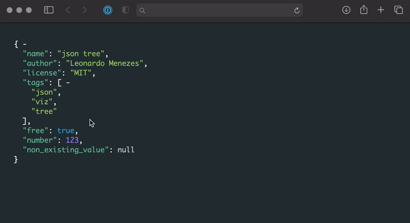

# json-tree

simple JS library that creates an html navigable tree from JSON object.

## Usage

Use the function `JSON.create(data)` to transform a data object into raw HTML which can then be set as the innerHTML of
an existing element.
 

The result of the previous example should render the following structure:

## Customising the looks

The colors of the generated structure can be customised through the following CSS classes:

- jstTree: Class applied to div element wrapping the whole structure

- jstProperty: Class applied to property names

- jstBool: Class applied to boolean values

- jstNum: Class applied to numeric values

- jstNull: Class applied to null values

- jstStr: Class applied to string values

- jstComma: Class applied to commas

- jstColon: Class applied to colon separating property name from property value

- jstCollapse: Class applied to the collapse symbol

- jstExpand: Class applied to the expand symbol

- jstBracket: Class applied to brackets (both {} and [])

- jstHiddenBlock: Class applied to collapsed blocks
